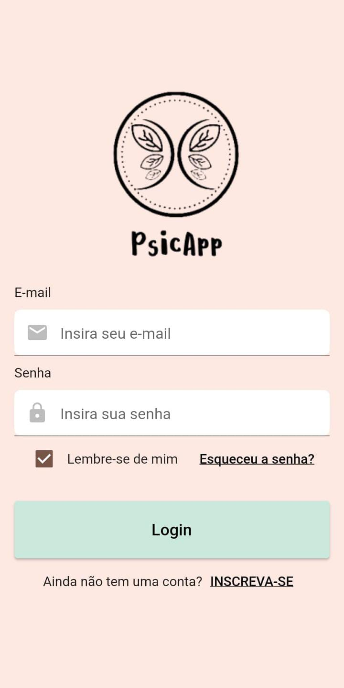
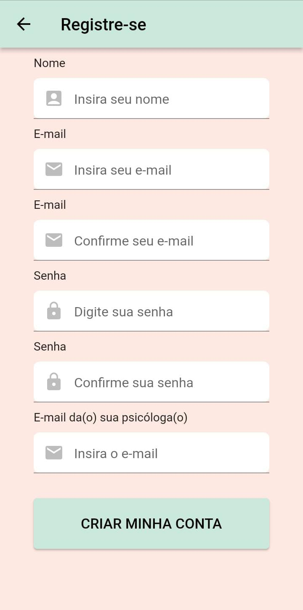
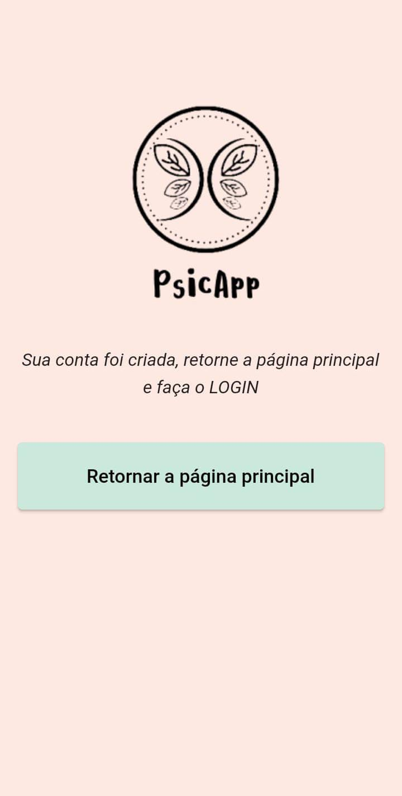
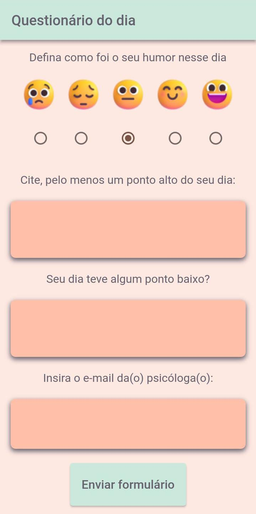

# PsicApp

Projeto feito para a Feira tecnológica do Inatel - Fetin 2023.

## Aplicativo para auxílio de consultas com psicólogos

Esse projeto surgiu com o intuito de ajudar pacientes a estruturar melhor suas ideias/acontecimentos para contar a seu psicólogo, esse que por sua vez terá as análises de sintomas (e outras demandas) potencializadas.

A ideia desse aplicativo (com suporte para Android e IOS) é que todos os dias o usuário responda um questionário sobre os pontos altos, humor e pontos baixos de seu dia. As respostas são salvas no banco de dados e através de Cloud Fuctions são enviadas imediatamente para o email do profissional responsável pelo antedimento.

Para o desenvolvimento do projeto utilizamos como principais tecnologias:

- [Flutter](https://flutter.dev/)
- [Firebase](https://firebase.google.com/?hl=pt)
- [Twilio SendGrid API](https://docs.sendgrid.com/pt-br/)

  
Para que o paciente seja identificado pelo psicólogo e para que os dados sejam salvos de forma segura foi necessário um sistema de autencitação (Login/Cadastro). Após autenticado o usuário já é redirecionado para a página do questionário.

  

    

       
       
        
       
    

  

  
Para mais informações e dowload do aplicativo clique aqui: <a href="https://anagvaleta.github.io/psicapp/">PsicApp</a>

